# Home-Ops: Enterprise-Grade Infrastructure & Security Platform

A comprehensive Kubernetes-based home lab infrastructure implementing enterprise-grade observability, data analytics, chaos engineering, incident response, and **comprehensive security controls**.

## Core components

| Icon                                                                                                                             | Name                                                                                                                  | Description                                                                                                                                                    |
| -------------------------------------------------------------------------------------------------------------------------------- | --------------------------------------------------------------------------------------------------------------------- | -------------------------------------------------------------------------------------------------------------------------------------------------------------- |
| ``             | [Cilium](https://cilium.io/)                                                                                             | Provides network routing, network security, exposing apps via LoadBalancers and other networking functionality.                                                |
| ``               | [Multus](https://github.com/k8snetworkplumbingwg/multus-cni)                                                             | Provides secondary network connectivity aside from Cilium, such as connecting pods and KubeVirt VMs to specific VLANs' L2 domains directly.                    |
| ``                 | [Rook-Ceph](https://rook.io/)                                                                                            | Provides and manages highly available networked persistent storage within the Kubernetes cluster itself.                                                       |
| ``             | [VolSync](https://volsync.backube.io/)                                                                                   | Provides and manages automated backups and restores of persistent storage.                                                                                     |
| ``           | [democratic-csi](https://github.com/democratic-csi/democratic-csi)                                                       | Wildcard storage CSI driver supporting multiple backends like local-hostpath.                                                                                  |
| ``                 | [Flux](https://fluxcd.io/)                                                                                               | Provides GitOps automation for syncing desired state of resources.                                                                                             |
| ``               | [external-secrets](https://external-secrets.io/)                                                                         | Syncs secrets from external sources like 1Password as Kubernetes secrets, with a templating engine.                                                            |
| ``               | [k8s-gateway](https://gateway-api.sigs.k8s.io/)                                                                          | Internal DNS resolver for exposing apps via Ingress, Gateway API and LoadBalancer Services.                                                                    |
| ``           | [external-dns](https://github.com/kubernetes-sigs/external-dns)                                                          | Syncs DNS records against upstream resolvers' records, such as Cloudflare DNS.                                                                                 |
| `` | [cert-manager](https://cert-manager.io/)                                                                                 | Automated TLS management for generating and rotating signed and trusted TLS certificates stored as Kubernetes secrets.                                         |
| ``               | [Ingress-NGINX](https://kubernetes.github.io/ingress-nginx/)                                                             | Kubernetes Ingress controller for automated configuration of NGINX to reverse proxy HTTP/S apps with automated TLS from cert-manager.                          |
| ``               | [cloudflared](https://developers.cloudflare.com/cloudflare-one/connections/connect-apps/install-and-setup/tunnel-guide/) | Expose specific apps publicly via Cloudflare Zero Trust tunnel.                                                                                                |
| ``     | [Crunchy Postgres Operator](https://www.crunchydata.com/products/crunchy-postgresql-for-kubernetes/)                     | Automated HA Postgres cluster and backups management.                                                                                                          |
| ``     | [VictoriaMetrics](https://victoriametrics.com/)                                                                          | Pull-based monitoring platform.                                                                                                                                |
| ``     | [kube-prometheus-stack](https://github.com/prometheus-operator/kube-prometheus)                                          | Automated configuration and service discovery for Prometheus (and thus VictoriaMetrics), with shipped defaults for Kubernetes-focused monitoring and alerting. |
| ``           | [Kyverno](https://kyverno.io/)                                                                                           | Kubernetes API webhook policy engine, for validating, mutating and generating resources. Also abused as The Jank Engine.                                       |
| ``             | [Spegel](https://github.com/spegel-org/spegel)                                                                           | Transparent container registry cache mirror within cluster.                                                                                                    |
| ``     | [system-upgrade-controller](https://github.com/rancher/system-upgrade-controller)                                        | Auto-update of cluster components' versions such as Talos OS and Kubernetes versions. Combined with GitOps + Renovate for a PR-based auto-updating workflow.   |

## Core Components Architecture

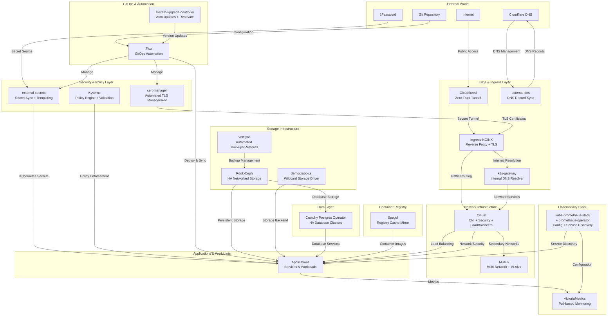

## Observability architecture overview

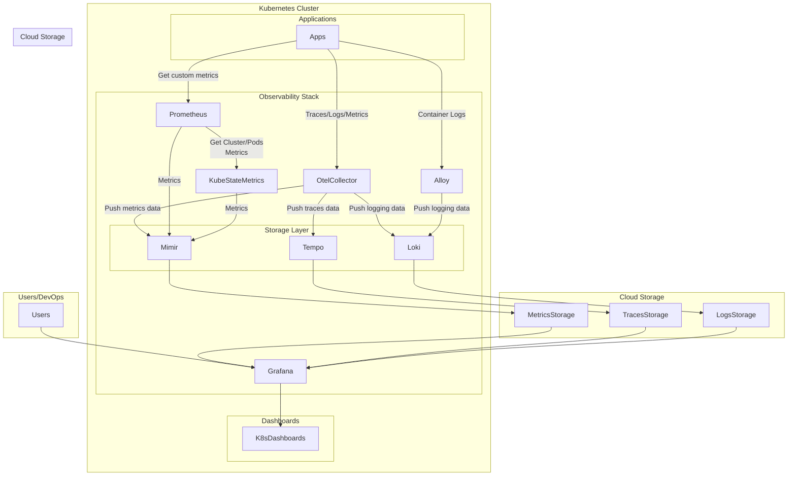

## Storage architecture overview

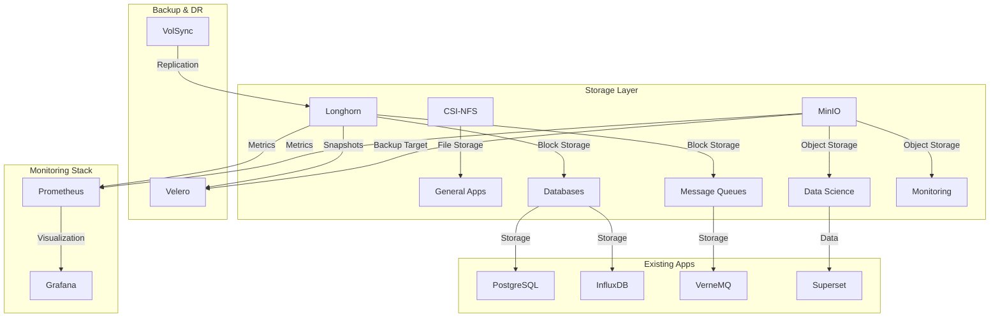

### Storage Components Overview

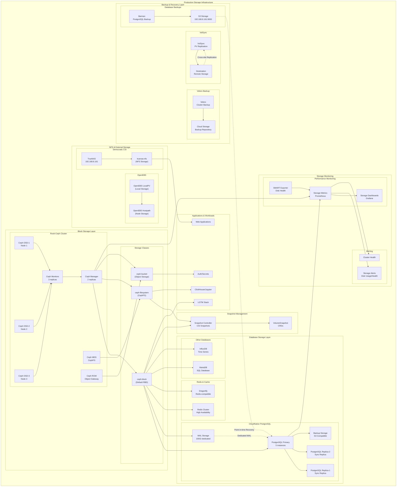

## Data platform architecture overview

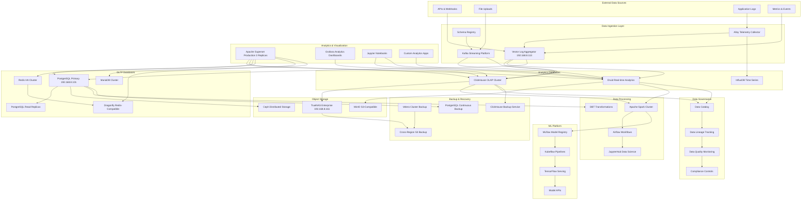

### Data Platform Service Interconnections

```mermaid
graph TD
    subgraph DataIngestion [Production Data Ingestion Pipeline]
        VectorAggregator[Vector Log Aggregator 192.168.8.113]
        AlloyCollector[Alloy Telemetry Collector]
        KafkaCluster[Kafka Streaming Cluster]
        SchemaRegistry[Confluent Schema Registry]
        KafkaConnect[Kafka Connect Connectors]
    end

    subgraph AnalyticsEngines [Analytics & OLAP Engines]
        ClickHouseCluster[ClickHouse Production Cluster]
        DruidCluster[Apache Druid Analytics Platform]
        InfluxDBCluster[InfluxDB Time Series Database]
    end

    subgraph TransactionalDBs [Transactional Databases - OLTP]
        PostgresPrimary[CloudNative PostgreSQL Primary]
        PostgresReplicas[PostgreSQL Read Replicas HA]
        MariaDBCluster[MariaDB Galera Cluster]
        RedisCluster[Redis Sentinel HA Cluster]
        DragonflyDB[Dragonfly Redis-Compatible Cache]
    end

    subgraph ObjectStorage [Enterprise Object Storage]
        TrueNASEnterprise[TrueNAS Enterprise Storage 192.168.8.161]
        MinIODistributed[MinIO Distributed S3 Storage]
        CephCluster[Ceph Distributed Storage Cluster]
        CephObjectGateway[Ceph RADOS Gateway]
    end

    subgraph DataProcessing [Big Data Processing Platform]
        ApacheSparkCluster[Apache Spark Distributed Processing]
        AirflowOrchestration[Apache Airflow Workflow Orchestration]
        JupyterHubPlatform[JupyterHub Multi-User Data Science]
        DBTTransformations[DBT Data Transformations]
        FlinkStreamProcessing[Apache Flink Stream Processing]
    end

    subgraph MLOpsStack [MLOps & Model Serving]
        MLflowRegistry[MLflow Model Registry & Tracking]
        KubeflowPipelines[Kubeflow ML Pipelines]
        TensorFlowServing[TensorFlow Model Serving]
        ModelAPIs[REST/gRPC Model APIs]
        FeatureStore[Feature Store]
    end

    subgraph AnalyticsPlatform [Analytics & Visualization Platform]
        SupersetProduction[Apache Superset Production 3 Replicas]
        GrafanaAnalytics[Grafana Analytics Dashboards]
        JupyterNotebooks[Jupyter Notebook Analytics]
        CustomDashboards[Custom Analytics Applications]
        ReportingEngine[Automated Reporting Engine]
    end

    subgraph DataGovernance [Enterprise Data Governance]
        ApacheAtlas[Apache Atlas Data Catalog]
        DataLineage[Data Lineage & Impact Analysis]
        DataQuality[Great Expectations Data Quality]
        SchemaEvolution[Schema Evolution Management]
        ComplianceAuditing[GDPR/SOX Compliance Auditing]
    end

    subgraph MonitoringObservability [Data Platform Monitoring]
        PrometheusDataMetrics[Prometheus Data Platform Metrics]
        LokiDataLogs[Loki Data Platform Logs]
        JaegerDataTracing[Jaeger Data Pipeline Tracing]
        AlertManagerData[AlertManager Data Platform Alerts]
        GrafanaMonitoring[Grafana Monitoring Dashboards]
    end

    subgraph BackupRecovery [Backup & Disaster Recovery]
        VeleroClusterBackup[Velero Full Cluster Backup]
        PostgresWALBackup[PostgreSQL WAL-E Continuous Backup]
        ClickHouseBackupService[ClickHouse Backup Service]
        DruidDeepStorageBackup[Druid Deep Storage Backup]
        CrossRegionReplication[Cross-Region Data Replication]
    end

    %% Primary Data Flow
    VectorAggregator -->|Structured Logs| ClickHouseCluster
    VectorAggregator -->|Log Streams| DruidCluster
    AlloyCollector -->|Telemetry Data| VectorAggregator
    KafkaCluster -->|Real-time Events| DruidCluster
    SchemaRegistry -->|Schema Validation| KafkaCluster
    KafkaConnect -->|Change Data Capture| KafkaCluster

    %% Analytics Database Connections
    ClickHouseCluster -->|Aggregated Data| TrueNASEnterprise
    DruidCluster -->|Deep Storage| MinIODistributed
    InfluxDBCluster -->|Time Series Storage| CephCluster

    %% OLTP Database Replication
    PostgresPrimary -->|Streaming Replication| PostgresReplicas
    PostgresPrimary -->|Change Streams| KafkaCluster
    RedisCluster -->|Session Data| DragonflyDB
    MariaDBCluster -->|Row-based Replication| PostgresReplicas

    %% Object Storage Integration
    CephCluster -->|Object API| CephObjectGateway
    CephObjectGateway -->|S3 Compatible| MinIODistributed
    TrueNASEnterprise -->|NFS/SMB| CephCluster

    %% Data Processing Workflows
    ClickHouseCluster -->|Batch Processing| ApacheSparkCluster
    DruidCluster -->|Stream Processing| FlinkStreamProcessing
    ApacheSparkCluster -->|Workflow Orchestration| AirflowOrchestration
    AirflowOrchestration -->|Notebook Execution| JupyterHubPlatform
    PostgresPrimary -->|Data Transformations| DBTTransformations

    %% ML Platform Integration
    ApacheSparkCluster -->|Feature Engineering| MLflowRegistry
    MLflowRegistry -->|Model Training| KubeflowPipelines
    KubeflowPipelines -->|Model Deployment| TensorFlowServing
    TensorFlowServing -->|Model APIs| ModelAPIs
    ClickHouseCluster -->|Feature Store| FeatureStore

    %% Analytics & Visualization
    SupersetProduction -->|OLAP Queries| ClickHouseCluster
    SupersetProduction -->|Real-time Analytics| DruidCluster
    SupersetProduction -->|Metadata Storage| PostgresPrimary
    SupersetProduction -->|Cache Layer| RedisCluster
    GrafanaAnalytics -->|Metrics Visualization| PrometheusDataMetrics
    JupyterNotebooks -->|Data Science| ClickHouseCluster
    CustomDashboards -->|Custom Analytics| DruidCluster
    ReportingEngine -->|Automated Reports| SupersetProduction

    %% Data Governance
    ApacheAtlas -->|Metadata Discovery| ClickHouseCluster
    ApacheAtlas -->|Data Discovery| DruidCluster
    DataLineage -->|Impact Analysis| ApacheAtlas
    DataQuality -->|Quality Metrics| PrometheusDataMetrics
    SchemaEvolution -->|Schema Management| SchemaRegistry
    ComplianceAuditing -->|Audit Trails| LokiDataLogs

    %% Monitoring & Observability
    ClickHouseCluster -->|Query Metrics| PrometheusDataMetrics
    DruidCluster -->|Ingestion Metrics| PrometheusDataMetrics
    PostgresPrimary -->|Database Logs| LokiDataLogs
    SupersetProduction -->|Request Tracing| JaegerDataTracing
    PrometheusDataMetrics -->|Alert Rules| AlertManagerData
    AlertManagerData -->|Visualization| GrafanaMonitoring

    %% Backup & Recovery
    PostgresPrimary -->|Continuous Backup| PostgresWALBackup
    ClickHouseCluster -->|Incremental Backup| ClickHouseBackupService
    DruidCluster -->|Deep Storage Backup| DruidDeepStorageBackup
    TrueNASEnterprise -->|Cross-Region Sync| CrossRegionReplication
    VeleroClusterBackup -->|Disaster Recovery| CrossRegionReplication
```

## Security architecture overview

```mermaid
graph TB
    subgraph "Production Security Infrastructure"
        subgraph "Identity & Access Management"
            subgraph "Authentication Layer"
                AUTHELIA["<br/>Authelia<br/>Multi-Factor Auth"]
                LLDAP["<br/>LLDAP<br/>LDAP Directory"]
                AUTHENTIK["<br/>Authentik<br/>Identity Provider"]
                KEYCLOAK["<br/>Keycloak<br/>SSO Provider"]
            end

            subgraph "Authorization & Proxy"
                OAUTH2_PROXY["<br/>OAuth2-Proxy<br/>Auth Middleware"]
                GLAUTH["<br/>GLAuth<br/>Lightweight LDAP"]
            end
        end

        subgraph "Network Security Layer"
            subgraph "Zero-Trust Network"
                NETWORK_POLICIES["<br/>Network Policies<br/>Micro-segmentation"]
                CILIUM["<br/>Cilium<br/>CNI Security"]
                TAILSCALE["<br/>Tailscale<br/>Mesh VPN"]
            end

            subgraph "DNS Security"
                ADGUARD["<br/>AdGuard<br/>DNS Filtering"]
                BLOCKY["<br/>Blocky<br/>DNS Blocker"]
                PIHOLE["<br/>Pi-hole<br/>Network-wide blocking"]
            end
        end

        subgraph "Runtime Security & Monitoring"
            subgraph "Intrusion Detection"
                FALCO["<br/>Falco<br/>Runtime Security"]
                TETRAGON["<br/>Tetragon<br/>eBPF Security"]
                CROWDSEC["<br/>CrowdSec<br/>Behavioral Analysis"]
                WAZUH["<br/>Wazuh<br/>SIEM/HIDS"]
            end

            subgraph "Behavioral Analysis"
                BEHAVIOR_ENGINE["<br/>Behavior Analysis<br/>ML Anomaly Detection"]
                THREAT_INTEL["<br/>Threat Intelligence<br/>IOC Feeds"]
            end
        end

        subgraph "Vulnerability Management"
            subgraph "Security Scanning"
                TRIVY["<br/>Trivy<br/>Container Scanner"]
                TRIVY_OPERATOR["<br/>Trivy Operator<br/>K8s Security Scans"]
                CONTAINER_SCAN["<br/>Container Scanning<br/>CI/CD Pipeline"]
                SAST_SCAN["<br/>SAST Scanner<br/>Static Analysis"]
                DAST_SCAN["<br/>DAST Scanner<br/>Dynamic Analysis"]
            end

            subgraph "Compliance"
                DEPENDENCY_SCAN["<br/>Dependency Scanner<br/>SCA Analysis"]
                CIS_BENCHMARK["<br/>CIS Benchmarks<br/>Compliance Checks"]
                NIST_COMPLIANCE["<br/>NIST Framework<br/>Security Controls"]
            end
        end

        subgraph "Secrets Management"
            subgraph "External Secrets"
                EXTERNAL_SECRETS["<br/>External Secrets<br/>Operator"]
                ONEPASSWORD["<br/>1Password<br/>Secrets Provider"]
                SECRET_STORES["<br/>Secret Stores<br/>Vault Integration"]
            end

            subgraph "Encryption"
                SOPS["<br/>SOPS<br/>Secret Encryption"]
                AGE_KEYS["<br/>Age Keys<br/>Encryption Keys"]
            end
        end

        subgraph "Security Monitoring & Response"
            subgraph "SIEM/SOAR"
                SECURITY_DASHBOARD["<br/>Security Dashboard<br/>Grafana"]
                INCIDENT_RESPONSE["<br/>Incident Response<br/>Automated Workflow"]
                THREAT_HUNTING["<br/>Threat Hunting<br/>Proactive Detection"]
            end

            subgraph "Alerting & Notification"
                SECURITY_ALERTS["<br/>Security Alerts<br/>Prometheus Rules"]
                GOTIFY["<br/>Gotify<br/>Push Notifications"]
                SMTP_RELAY["<br/>SMTP Relay<br/>Email Alerts"]
            end
        end

        subgraph "Application Security"
            subgraph "Web Application Security"
                WAF["<br/>Web App Firewall<br/>Ingress Protection"]
                RATE_LIMITING["<br/>Rate Limiting<br/>DDoS Protection"]
                SECURITY_HEADERS["<br/>Security Headers<br/>HTTP Security"]
            end

            subgraph "API Security"
                API_GATEWAY["<br/>API Gateway<br/>Request Validation"]
                JWT_VALIDATION["<br/>JWT Validation<br/>Token Security"]
            end
        end

        subgraph "Security Orchestration"
            subgraph "Automated Response"
                QUARANTINE["<br/>Auto Quarantine<br/>Threat Isolation"]
                SECURITY_POLICIES["<br/>Security Policies<br/>Pod Security Standards"]
                ADMISSION_CTRL["<br/>Admission Controller<br/>Policy Enforcement"]
            end
        end
    end

    %% Authentication Flow
    LLDAP --> AUTHELIA
    AUTHELIA --> OAUTH2_PROXY
    AUTHENTIK --> OAUTH2_PROXY
    KEYCLOAK --> OAUTH2_PROXY
    GLAUTH --> AUTHELIA

    %% Network Security
    NETWORK_POLICIES --> CILIUM
    TAILSCALE --> CILIUM
    ADGUARD --> BLOCKY
    BLOCKY --> PIHOLE

    %% Runtime Security
    FALCO --> BEHAVIOR_ENGINE
    TETRAGON --> BEHAVIOR_ENGINE
    CROWDSEC --> THREAT_INTEL
    WAZUH --> THREAT_INTEL
    BEHAVIOR_ENGINE --> INCIDENT_RESPONSE

    %% Vulnerability Management
    TRIVY --> TRIVY_OPERATOR
    TRIVY_OPERATOR --> SECURITY_DASHBOARD
    CONTAINER_SCAN --> TRIVY
    SAST_SCAN --> SECURITY_DASHBOARD
    DAST_SCAN --> SECURITY_DASHBOARD
    DEPENDENCY_SCAN --> CIS_BENCHMARK
    CIS_BENCHMARK --> NIST_COMPLIANCE

    %% Secrets Management
    ONEPASSWORD --> EXTERNAL_SECRETS
    SECRET_STORES --> EXTERNAL_SECRETS
    EXTERNAL_SECRETS --> SOPS
    SOPS --> AGE_KEYS

    %% Security Monitoring
    FALCO --> SECURITY_ALERTS
    TRIVY --> SECURITY_ALERTS
    WAZUH --> SECURITY_ALERTS
    SECURITY_ALERTS --> SECURITY_DASHBOARD
    SECURITY_ALERTS --> GOTIFY
    SECURITY_ALERTS --> SMTP_RELAY
    THREAT_HUNTING --> SECURITY_DASHBOARD

    %% Application Security
    OAUTH2_PROXY --> WAF
    WAF --> RATE_LIMITING
    RATE_LIMITING --> SECURITY_HEADERS
    API_GATEWAY --> JWT_VALIDATION

    %% Automated Response
    INCIDENT_RESPONSE --> QUARANTINE
    SECURITY_POLICIES --> ADMISSION_CTRL
    ADMISSION_CTRL --> QUARANTINE

    %% Integration with Observability
    SECURITY_DASHBOARD -.->|"Security Metrics"| SECURITY_ALERTS
    THREAT_INTEL -.->|"IOC Updates"| FALCO
    BEHAVIOR_ENGINE -.->|"ML Models"| CROWDSEC
```

### Secrets Management Integration

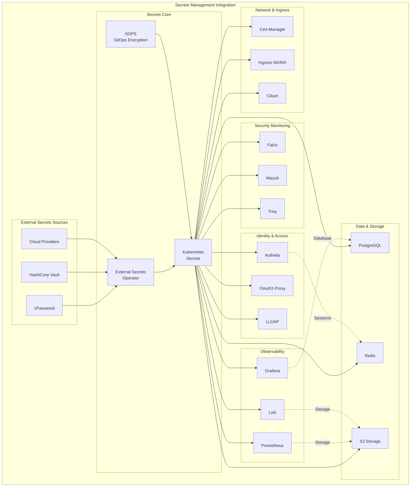

## Networking architecture overview

```mermaid
graph TD
    A[Internet] --> B[Cloudflare Production CDN/WAF]
    B --> C[Cloudflare Secure Tunnel]
    C --> D[Production External Gateway 192.168.8.139]

    A --> E[Enterprise Edge Router 192.168.8.1]
    E --> F[Production BGP Peer 192.168.8.145]
    E --> G[Enterprise Storage Array 192.168.8.161]

    A --> H[Enterprise VPN Infrastructure]
    H --> I[Twingate Zero Trust Access]
    H --> J[Tailscale Production Mesh]
    H --> K[WireGuard Production Gateway]
    H --> L[OpenVPN Enterprise Gateway]

    subgraph M[Production Kubernetes Infrastructure]
        N[HA Control Plane VIP 192.168.8.136]
        O[Cilium Production CNI with eBPF]
        P[Multus Enterprise Multi-Network]
        Q[Production BGP Control Plane]

        R[Production External Gateway 192.168.8.139]
        S[Production Internal Gateway 192.168.8.138]
        T[Enterprise DNS Gateway 192.168.8.137]

        U[Production Network Policies]
        V[Cilium Enterprise Security Policies]
        W[Zero Trust Production Network]
        X[Enterprise Service Mesh Security]

        Y[Production CoreDNS Cluster]
        Z[Enterprise AdGuard DNS Security]
        AA[Production Blocky DNS Filter]
        BB[Enterprise Pi-hole Protection]
        CC[Production DNS Threat Protection]

        DD[Production Authentik Identity Platform]
        EE[Enterprise Authelia Authentication]
        FF[Production LLDAP Directory]
        GG[Enterprise OAuth2 Proxy]
        HH[Production Keycloak SSO]

        II[Production Falco Runtime Security]
        JJ[Enterprise Tetragon eBPF Security]
        KK[Production CrowdSec IPS/IDS]
        LL[Enterprise Wazuh SIEM Platform]
        MM[Production Behavior Analysis Engine]

        NN[Enterprise External Secrets Operator]
        OO[Production Cert Manager TLS]
        PP[Enterprise 1Password Integration]
        QQ[Production SOPS Encryption]

        RR[Production OPA Gatekeeper Policies]
        SS[Enterprise Pod Security Standards]
        TT[Production Admission Controllers]
        UU[Enterprise Trivy Vulnerability Scanner]

        VV[Production Security Operations Center]
        WW[Enterprise Incident Response Automation]
        XX[Production Threat Hunting Platform]
        YY[Enterprise Vector Log Aggregation 192.168.8.113]
        ZZ[Production Alertmanager Security]

        AAA[Production PostgreSQL Cluster 192.168.8.101]
        BBB[Enterprise Syncthing Service 192.168.8.117]
        CCC[Production VerneMQ MQTT Broker 192.168.8.127]
        DDD[Enterprise Graphite Metrics 192.168.8.109]
    end

    E --> M
    F --> Q
    H --> M

    O --> R
    O --> S
    O --> T
    O --> U

    T --> Y
    Y --> Z
    Z --> AA
    AA --> BB
    BB --> CC

    R --> GG
    GG --> DD
    DD --> FF
    EE --> FF

    II --> KK
    JJ --> MM
    KK --> LL

    OO --> R
    OO --> S
    NN --> PP

    RR --> TT
    SS --> TT
    UU --> VV

    II --> VV
    VV --> WW
    VV --> XX

    M --> G
```

### Service Interconnection Architecture

```mermaid
graph TD
    %% External Layer
    Internet[Internet/WAN]
    CloudFlare[Cloudflare CDN/WAF]
    CloudflareTunnel[Cloudflare Tunnel]
    EdgeRouter[Enterprise Edge Router 192.168.8.1]
    BGPPeer[BGP Peer 192.168.8.145]
    TrueNAS[TrueNAS Storage 192.168.8.161]

    %% VPN Layer
    Twingate[Twingate Zero Trust]
    Tailscale[Tailscale Mesh]
    WireGuard[WireGuard Gateway]
    OpenVPN[OpenVPN Gateway]

    %% Kubernetes Core
    ControlPlane[Control Plane VIP 192.168.8.136]
    Cilium[Cilium CNI eBPF]
    BGPControl[BGP Control Plane]

    %% Gateways
    ExtGW[External Gateway 192.168.8.139]
    IntGW[Internal Gateway 192.168.8.138]
    K8sGW[K8s Gateway 192.168.8.137]

    %% DNS Stack
    CoreDNS[CoreDNS]
    AdGuard[AdGuard Home]
    Blocky[Blocky Filter]
    PiHole[Pi-hole]

    %% Identity Stack
    Authentik[Authentik IDP]
    OAuth2Proxy[OAuth2 Proxy]
    LLDAP[LLDAP Directory]
    Authelia[Authelia Auth]

    %% Security Stack
    Falco[Falco Runtime Security]
    Tetragon[Tetragon eBPF]
    CrowdSec[CrowdSec IPS]
    WazuhSIEM[Wazuh SIEM]

    %% Network Security
    NetworkPolicies[Network Policies]
    CiliumNetPol[Cilium Policies]
    ServiceMesh[Service Mesh]

    %% Secrets & Certs
    ExternalSecrets[External Secrets]
    CertManager[Cert Manager]
    OnePassword[1Password]
    SOPS[SOPS Encryption]

    %% Monitoring & Alerting
    Vector[Vector 192.168.8.113]
    Alloy[Alloy Collector]
    Prometheus[Prometheus]
    Grafana[Grafana]
    Alertmanager[Alertmanager]

    %% SOC Platform
    SecurityDashboard[Security Dashboard]
    IncidentResponse[Incident Response]
    ThreatHunting[Threat Hunting]

    %% Application Services
    PostgresLB[PostgreSQL 192.168.8.101]
    SyncthingLB[Syncthing 192.168.8.117]
    VerneMQLB[VerneMQ 192.168.8.127]
    GraphiteLB[Graphite 192.168.8.109]

    %% Policy & Compliance
    OPAGatekeeper[OPA Gatekeeper]
    AdmissionController[Admission Controllers]
    TrivyOperator[Trivy Scanner]

    %% External Connections
    Internet -->|HTTPS/TLS| CloudFlare
    CloudFlare -->|Encrypted Tunnel| CloudflareTunnel
    CloudflareTunnel -->|TLS 1.3| ExtGW

    Internet -->|Router/Firewall| EdgeRouter
    EdgeRouter -->|BGP Routes| BGPPeer
    EdgeRouter -->|NFS/SMB| TrueNAS
    EdgeRouter -->|Cluster Network| ControlPlane

    %% VPN Interconnections
    Internet -->|Zero Trust| Twingate
    Internet -->|Mesh VPN| Tailscale
    Twingate -->|Encrypted| WireGuard
    Tailscale -->|WG Protocol| WireGuard
    WireGuard -->|VPN Traffic| Cilium
    OpenVPN -->|Legacy VPN| Cilium

    %% BGP and Routing
    BGPPeer -->|Route Advertisement| BGPControl
    BGPControl -->|Load Balancer IPs| Cilium
    Cilium -->|L2 Announcements| EdgeRouter

    %% CNI and Gateway Integration
    ControlPlane -->|API Server| Cilium
    Cilium -->|Gateway API| ExtGW
    Cilium -->|Gateway API| IntGW
    Cilium -->|DNS Services| K8sGW
    Cilium -->|Network Policies| NetworkPolicies
    Cilium -->|Security Policies| CiliumNetPol

    %% DNS Resolution Chain
    K8sGW -->|DNS Queries| CoreDNS
    CoreDNS -->|Upstream DNS| AdGuard
    AdGuard -->|Filtered Queries| Blocky
    Blocky -->|Ad Blocking| PiHole
    PiHole -->|Clean DNS| EdgeRouter

    %% Identity and Authentication Flow
    ExtGW -->|Auth Required| OAuth2Proxy
    IntGW -->|Auth Required| OAuth2Proxy
    OAuth2Proxy -->|OIDC/SAML| Authentik
    OAuth2Proxy -->|Session Auth| Authelia
    Authentik -->|User Directory| LLDAP
    Authelia -->|User Directory| LLDAP

    %% Security Monitoring Integration
    Cilium -->|eBPF Events| Tetragon
    Cilium -->|Network Events| Falco
    Tetragon -->|Security Events| CrowdSec
    Falco -->|Runtime Events| CrowdSec
    CrowdSec -->|Threat Intelligence| WazuhSIEM
    WazuhSIEM -->|SIEM Data| SecurityDashboard

    %% Service Mesh Security
    Cilium -->|mTLS Enforcement| ServiceMesh
    ServiceMesh -->|Encrypted Traffic| ApplicationServices
    NetworkPolicies -->|Traffic Control| ServiceMesh
    CiliumNetPol -->|eBPF Filtering| ServiceMesh

    %% Certificate and Secret Management
    CertManager -->|TLS Certificates| ExtGW
    CertManager -->|TLS Certificates| IntGW
    CertManager -->|Service Certificates| ServiceMesh
    ExternalSecrets -->|Secret Sync| OnePassword
    ExternalSecrets -->|Encrypted Secrets| SOPS
    SOPS -->|Git Encryption| ExternalSecrets

    %% Observability Data Flow
    Cilium -->|Metrics/Logs| Vector
    Tetragon -->|Security Metrics| Vector
    Falco -->|Security Logs| Vector
    CrowdSec -->|IPS Metrics| Vector
    Vector -->|Aggregated Data| Prometheus
    Vector -->|Log Streams| Alloy
    Alloy -->|Telemetry| Prometheus
    Prometheus -->|Metrics| Grafana
    Prometheus -->|Alerts| Alertmanager

    %% Security Operations Integration
    WazuhSIEM -->|Security Alerts| Alertmanager
    SecurityDashboard -->|Incident Data| IncidentResponse
    SecurityDashboard -->|Threat Data| ThreatHunting
    IncidentResponse -->|Auto Remediation| CiliumNetPol
    IncidentResponse -->|Quarantine| NetworkPolicies

    %% Policy and Compliance
    OPAGatekeeper -->|Policy Validation| AdmissionController
    AdmissionController -->|Pod Validation| ControlPlane
    TrivyOperator -->|Vulnerability Scans| SecurityDashboard
    TrivyOperator -->|Security Metrics| Prometheus

    %% Application Load Balancer Integration
    Cilium -->|Load Balancing| PostgresLB
    Cilium -->|Load Balancing| SyncthingLB
    Cilium -->|Load Balancing| VerneMQLB
    Cilium -->|Load Balancing| GraphiteLB

    %% Storage Integration
    PostgresLB -->|Database Storage| TrueNAS
    SyncthingLB -->|File Storage| TrueNAS
    Vector -->|Log Storage| TrueNAS

    %% Alerting and Notification Flow
    Alertmanager -->|Security Alerts| IncidentResponse
    Alertmanager -->|Critical Alerts| SecurityDashboard
    SecurityDashboard -->|SOC Alerts| ThreatHunting

    %% Application Services defined for clarity
    subgraph ApplicationServices [Application Services]
        PostgresLB
        SyncthingLB
        VerneMQLB
        GraphiteLB
    end
```

## FinOps(Kubecost) architecture overview

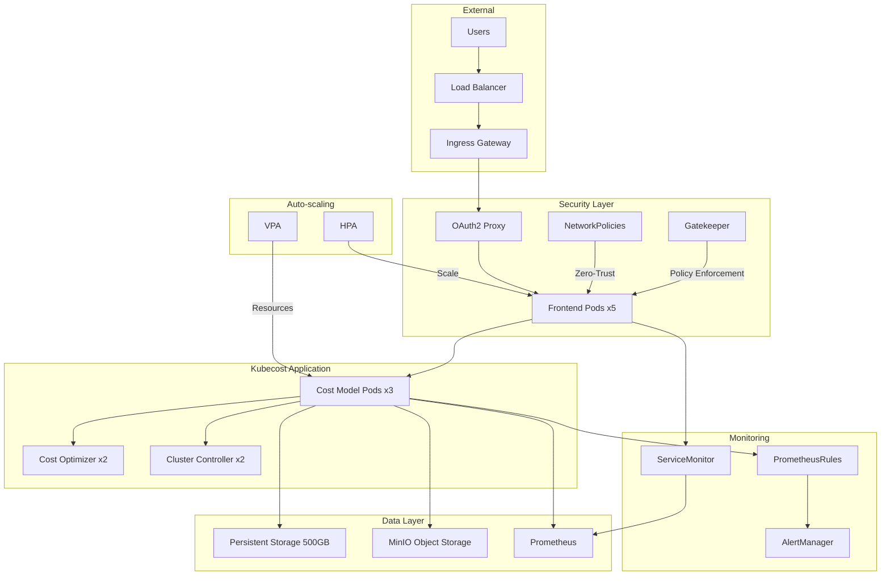

### 🤝 Thanks

I want to give credit to a few great resources:

- The (cluster-template)[https://github.com/onedr0p/cluster-template] on GitHub.
- The (Home Operations)[https://discord.gg/home-operations] Discord community.
- For deployment ideas and strategies, visit (kubesearch.dev)[https://kubesearch.dev/].